## 개요

- 진행기간 : 2024.11.16 ~ 2024.11.27
- 서비스명 : `DOGEBANK`

||역할|
|--|:---:|
|임남기| 팀장, back-end, PM, Rest-API |
|정수연| 팀원, front-end, UX/UI 디자인, Presenter, Vue| 

## 서비스 소개

### DOGEBANK 에서 나만의 예금 적금 플랜을 계획해 보세요!
DOGEBANK에서는 모든 예금/적금 상품을 비교 가능합니다. 나만의 금융정보에 딱 맞는 private한 금융상품을 추천받고, 나만의 예/적금 플랜 목표를 계획할 수 있습니다. 

## 기능 소개

### 1. 메인 페이지
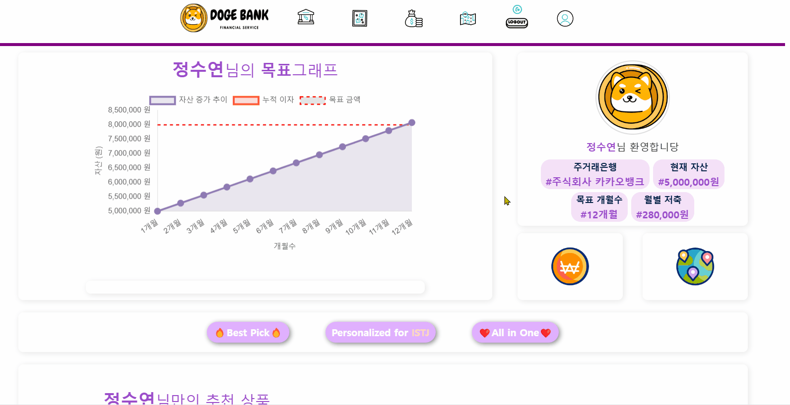
- 픽토그램 navbar 구성([https://www.flaticon.com/kr/search?word=지도&type=animated-icon](https://www.flaticon.com/kr/search?word=%EC%A7%80%EB%8F%84&type=animated-icon))
- dropdown 구현
- 환율계산과 은행찾기 div를 클릭하면 해당 화면으로 이동하도록 구현

> #### 로그인 + 금융정보 입력상태
+ 회원의 간단한 금융정보 제공
+ 금융정보를 통한 상품추천
+ 고른 상품 적용을 위한 chart 제공
+ 자세한 설명은 [`추천 알고리즘 및 목표 차트`](#2-추천-알고리즘) 부분을 참고
> #### 금융정보 미입력
+ 메인페이지의 모든 버튼을 통해 개인프로필 페이지로 이동
> #### 로그인 이전
+ 메인페이지의 구성은 금융정보 미입력 상태와 동일
+ 메인페이지의 모든 버튼을 통해 로그인화면으로 이동

### 2. 추천 알고리즘
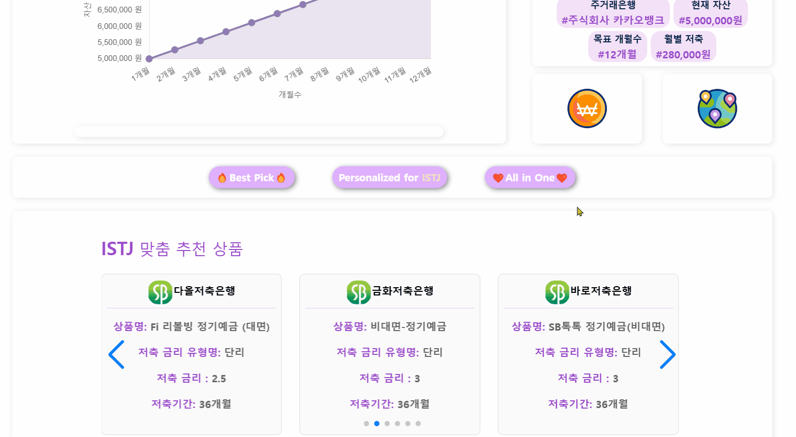

+ 자세한 설명은 [`추천 알고리즘 기능적 설명`](#추천-알고리즘-기능적-설명) 참고
+ 추천 상품은 swiper를 import해서 상품들이 화면에 3개씩 보이도록 설정하고 자동으로 넘어가도록 구현
+ 내 나이대 맞춤 추천상품
+ mbti 맞춤 추천상품
+ 내 금융정보 맞춤 추천상품

### 3. 목표차트
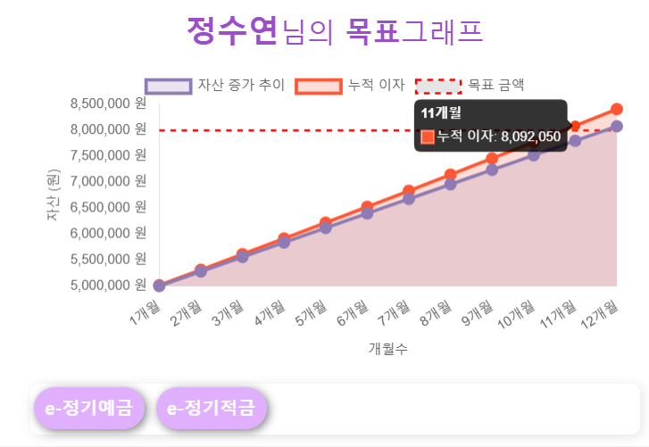
+ Chart.js 사용
+ 추천 상품 클릭시 차트에 적용
+ 상품의 저축기간 저축유형, 금리 등을 고려하여 매월 저축금액 및 이자를 차트에 적용한다.
+ 재 클릭시 적용 취소

### 4. 환율 페이지
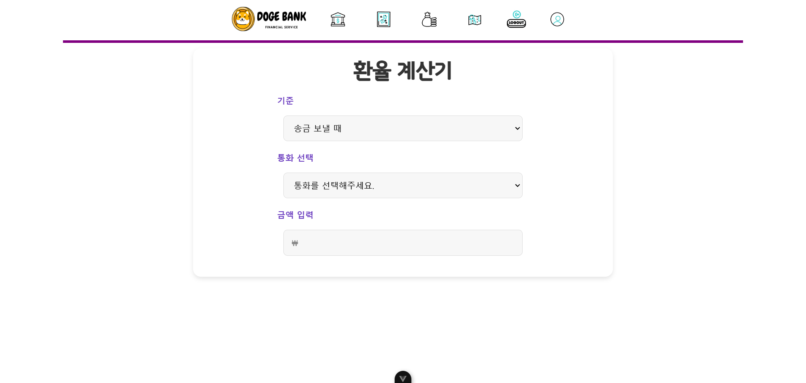
+ front에서 환율정보를 이용해서 환율계산 후 출력
+ 기준과 통화선택 후 금액 입력하면 환전금액 출력

### 5. 주변은행찾기
- KAKAO MAP API 사용
- 로그인 하지 않아도 은행 검색 기능 활성화

> #### 위치별 은행 찾기 
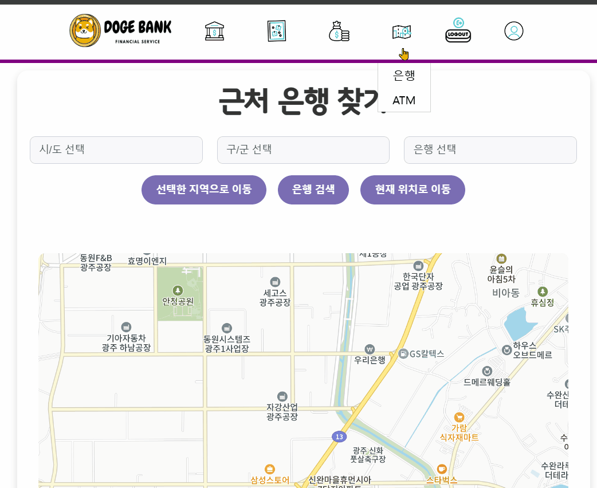

+ ‘시/도’, ‘구/군’, 은행 선택 후 은행검색 버튼 클릭 시 선택한 지역 근처의 은행들이 지도에 표시됨
> #### 근처 ATM 찾기
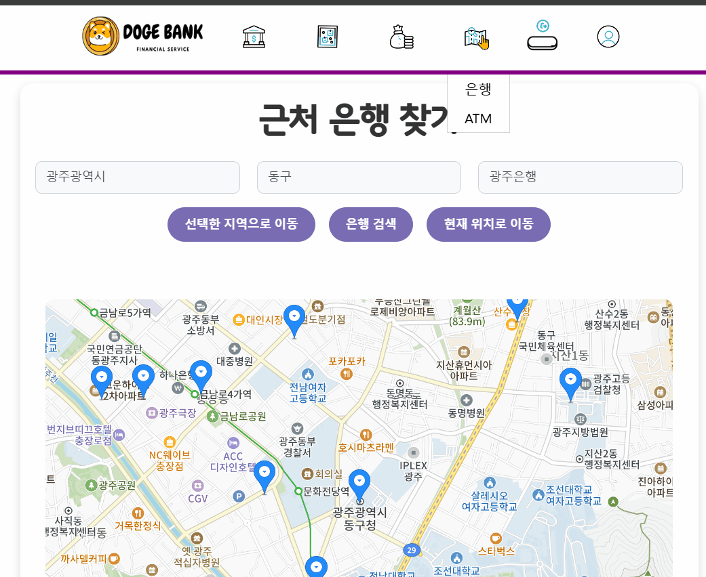

+ 현재 위치로 지도 이동 및 근처 atm 탐색

### 6. 회원가입
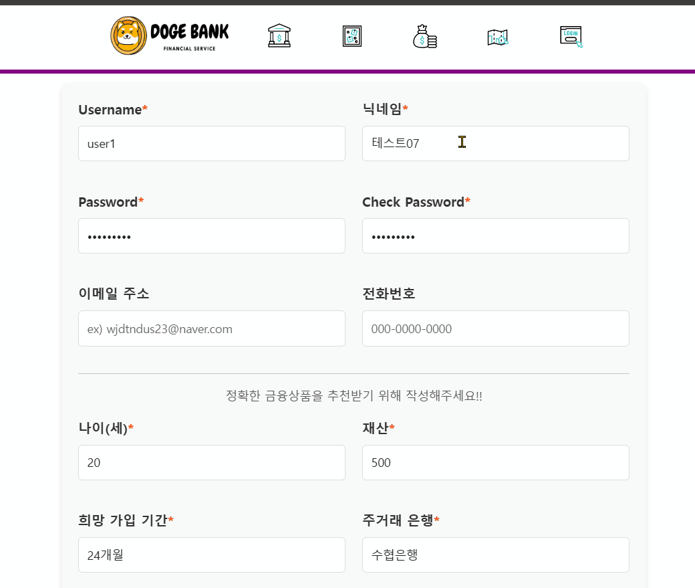

+ 성공시 자동로그인후 프로필 페이지로 rendering
+ 예외사항 처리 후 메세지 알람 
  + 필수항목 누락 
  + 비밀번호 불일치
  + username 중복
  + password 규칙

### 7. 로그인
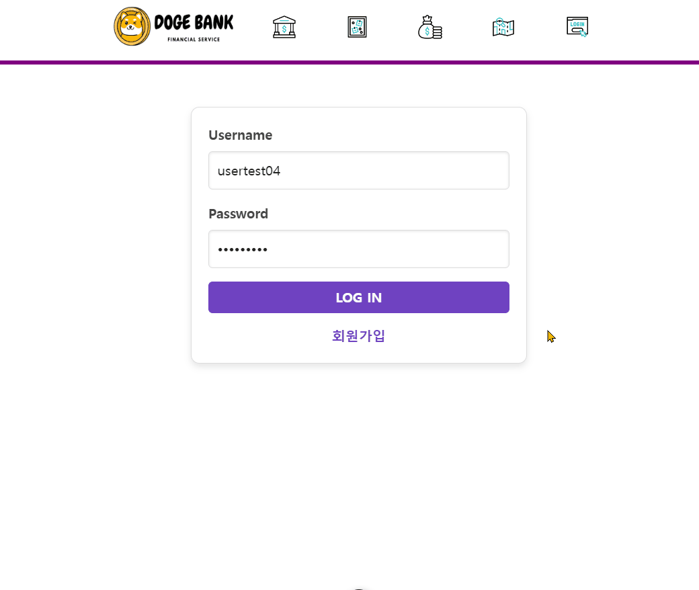

+ 로그인 후 프로필 페이지로 이동 
+ 예외사항 처리 후 메세지 알람
  + 필수항목 누락
  + 비밀번호 불일치

### 8. 회원 정보 수정 및 금융 정보 수정

+ 기존의 정보를 제공
+ 프로필 이미지 변경가능
+ 기본 프로필 이미지 변경
+ 금융정보는 미입력 가능

### 9. 회원 탈퇴

+ 회원 탈퇴를 위한 token 확인
+ 알림창을 통해 한번더 확인
+ 탈퇴 이후 게시글 및 기록 삭제

### 10. 게시판 `community`, `goal`, `QnA`
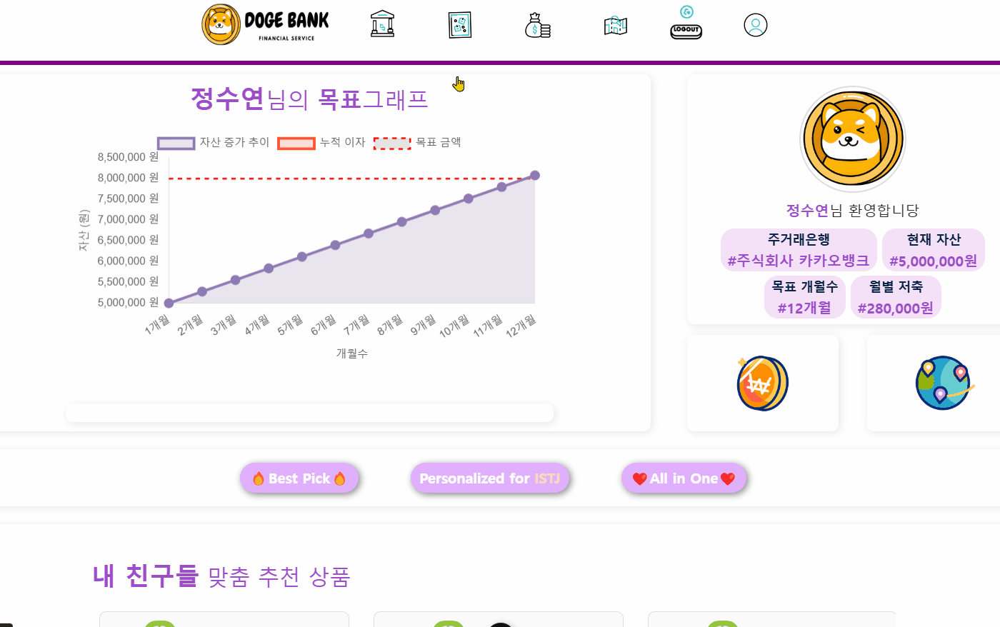

+ 게시판은 총 3개로 구분된다.
+ 하나의 모델을 사용하며, category 필드를 이용하여 구분된다.

### 11. 게시글 `CRUD`
+ 게시글의 작성자만이 수정 및 삭제 가능
+ 게시글의 작성자 정보 제공
+ 댓글 제공
### 12. 댓글 `CRUD`
+ 댓글의 작성자만이 수정 및 삭제 가능

### 13. 금융 상품 조회 및 필터링

+ 금융감독원 API 사용 
+ 예금페이지와 적금페이지 구분
+ 한페이지에 10개씩 제공
+ 최고우대금리 및 저축개월을 통한 정렬기능 제공
+ 은행별 필터링 제공
### 14. 금융 상품 상세조회
+ 금융상품명 클릭을 통해 이동
+ chart.js를 이용해 옵션의 금리를 차트로 표현
### 15. 찜 , 좋아요
+ 좋아요 수 확인가능
+ 찜 중복 불가
+ 찜 기록은 프로필 페이지에서 확인 가능

## 추천 알고리즘 기능적 설명

[`추천 알고리즘 기능소개 돌아가기`](#2-추천-알고리즘)

1. 기본설정
    - `DummyData`를 이용한 `DummyUser`를 생성하며, 각 user는 임의의 상품에 대해 `JJim` 혹은 `❤`를 한다.
    - 그 빈도수와 횟수는 각 20회 랜덤상품으로 하며, 조정가능하다.

2. 나이별 인기상품 추천
    - 각 상품을 JJim 한 User들을 역참조 하여 조회한다.
    - 조회된 User의 나이를 20대, 30대, 40대… 로 구분하여 컬럼을 생성한다.
    - 생성된 age_groups 하며, 나이대의 User들이 JJim 한 순서대로 추천을 진행한다.
    - 각 상품은 age_groups 별 JJim수를 알 수있게 된다.
    - 이를 이용하여 사용자의 나이대에 맞는 상품을 JJim 수를 통해 추천한다.

3. MBTI에 따른 상품 추천
    - User의 MBTI 유형으로 구분하여 추천한다. 예를들어 `I` 형 User에게 추천을 할때,
    - 상품명 혹은 유의사항 속 `비대면` 키워드의 포함여부를 판단하게 된다.
    - filtering 과 sort를 이용하여 유형별로 적절한 상품을 추천하게 된다.  

4. 목표별 private 상품 추천
   - User는 금융정보`FinInfo`를 추가로 등록 할 수 있다. 
   - 금융정보 중 `현재 자산` `목표 시점` `목표 금액` `저축 금액` 등을 고려하여 현재시점기준 목표시점까지의 목표 저축 계획에 따라서 최적의 상품을 추천하게 된다. 
     - 목표 시점보다 저축기간이 긴 상품은 추천하지 않는다.
     - 주거래 은행을 우선적으로 고려한다.
     - 예금과 적금을 구분하여 계산한다.
     - 복리와 단리를 구분하여 계산한다.
     - 매월 저축금액 및 이자, 자산을 계산한다.
     - 최적의 상품을 추천한다.

## 아키텍쳐

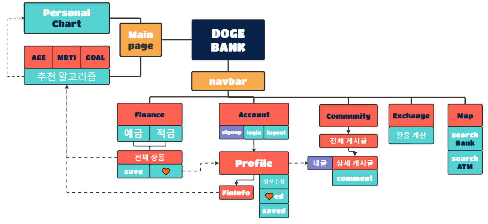

## ERD

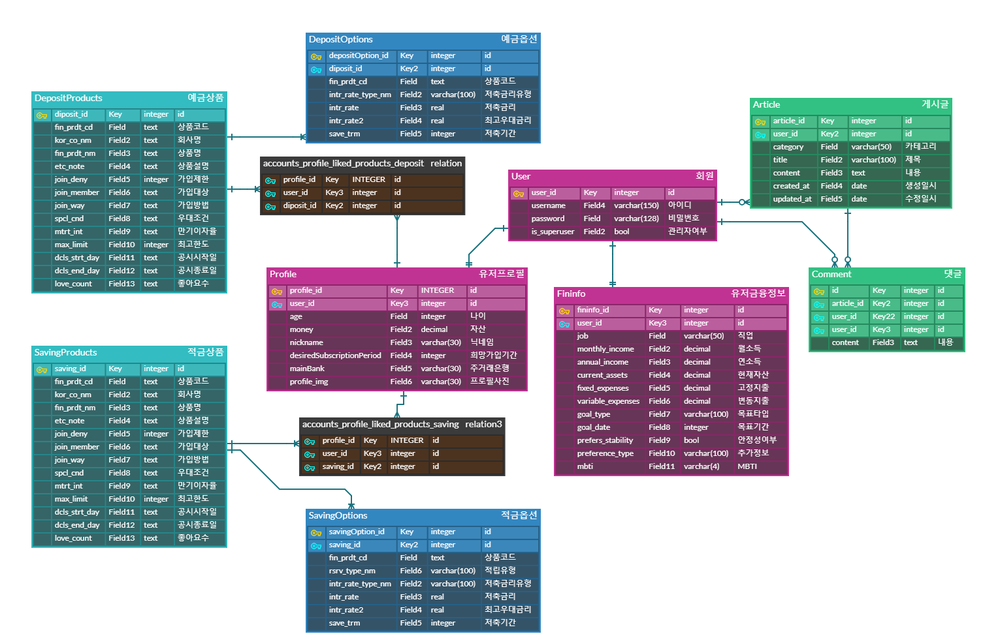

## 후기

### 임남기 

우선적으로 이번 프로젝트는 나에게 REST-API에 대한 심도 깊은 고민을 할 수 있는 기회가 되었다. Django의 API 호출 과정에서 공식문서와 community의 코드들을 읽고 분석하고 수정하고 하는 것이 나자신이 REST 되어감을 느꼈다. 

프로젝트가 없는 혼자만의 공부는, 학습을 하는 입장에서 빠르게 성장하는 것처럼 느껴졌었지만, 진짜 공부는 프로젝트를 통해서 해야겠다고 느꼈다. 때문에 이제까지 배웠던 python , django 그리고 웹을 하기위해 배웠던 front의 지식들까지. 모두 잊어버려서는 안되기 때문에, 바로 또다른 프로젝트를 시작하려 한다. 

그동안의 짧은 project들로부터 감각을 익혀 왔던 것이 프로젝트를 진행하는데에 있어 많은 도움이 되었다. 그럼에도 프로젝트를 진행함에 있어 어려움은 많았다. 초반에 디자인 작업을 소홀하게 한 뒤 프로젝트를 시작했고 프로젝트의 중반부를 넘어갈수록 component들이 복잡해지면서 통일감이 없는 웹사이트가 되어가고 있었다. 다시 하나하나 수정해 나가는 과정을 통해 초반 디자인 목업의 중요성을 깨닫게 되었다. 또한 초반 modeling 작업에 깊의 주의를 두지 못했고, 프로젝트 동안 7번의 모델 수정을 거치게 되었다. 물론 프로젝트에 있어서 초반 설계가 가장 중요하다는 사실은 알고 있었지만, 나의 예상보다 더욱 더더욱 중요하다는 점을 느끼게 해준 프로젝트였다.   

### 정수연

대부분의 Front-end를 맡아서 진행했는데 처음하는 프로젝트이고 Front-end도 처음이어서 어떤 Tool을 사용해서 어떻게 디자인을 해야 할지가 가장 어렵고 힘들었다. 특히 피그마 사용법에 익숙하지 않아서 원하는 만큼 깔끔하고 예쁘게 결과가 나오지 않은 것 같아 아쉽다.

프로젝트를 시작하는 시점에서 설계 아키텍처를 만들 때 실습할때는 경험하지 못했던 만큼 많은양의 component들을 다뤄야 해서 당황했고 어떻게 구성해야할지 고민하는데 시간이 많이 걸렸다. 특히 반복되는 화면을 구현하면서 component의 중요성을 느낄 수 있었다.

또한 Django에서 axios로 Data를 받아 Vue에서 사용해야 했는데 어떻게 받아와서 내가 원하는 Data만 뽑아서 써야할지 잘 몰라서 Chat의 도움을 받으며 진행했다. 특히 이 부분에서 팀원의 도움을 많이 받았는데 상대적으로 내가 많이 부족하다는 생각이 들어서 미안했다.ㅠㅠ

시간은 오래 걸렸지만 bootstrap 말고도 vue에서 사용하는 라이브러리가 많다는 것을 알게 되었고, bootstrap보다 사용법도 간단하고 더 많은 기능을 구현할 수 있다는 것도 알게되었다. 특히 docs의 중요성도 알게 되었고 무조건 chat한테만 물어보기 보다는 docs를 활용하는 것의 중요성을 느꼈다. 또한 프로젝트 진행 전 디자인 목업의 중요성을 진짜 뼈져리게 느꼈고 다음 프로젝트를 진행할 때는 무조건 시간이 걸리더라도 디자인목업을 완벽하게 마무리 해야겠다고 다짐했다. 힘들었지만 Front-end공부를 더 열심히 해야겠고 하고싶다는 생각이 들었다!